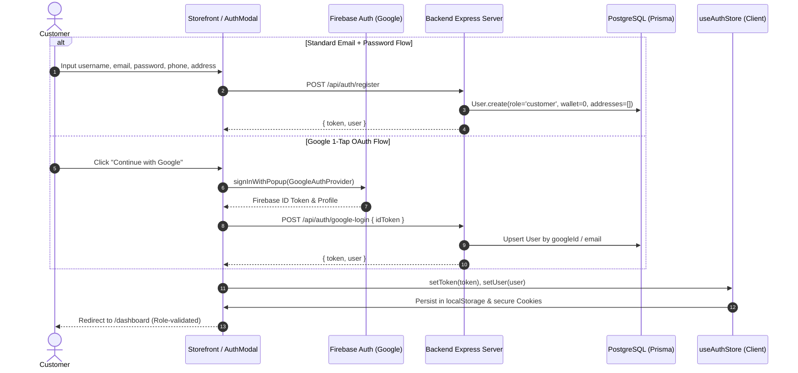
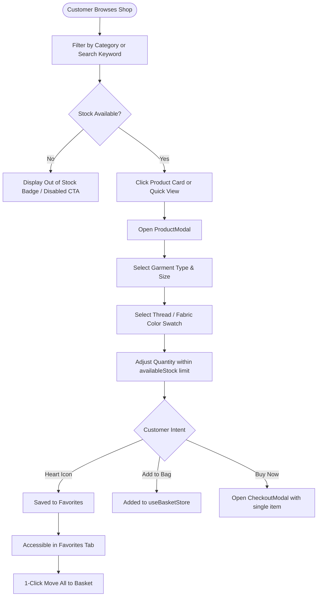
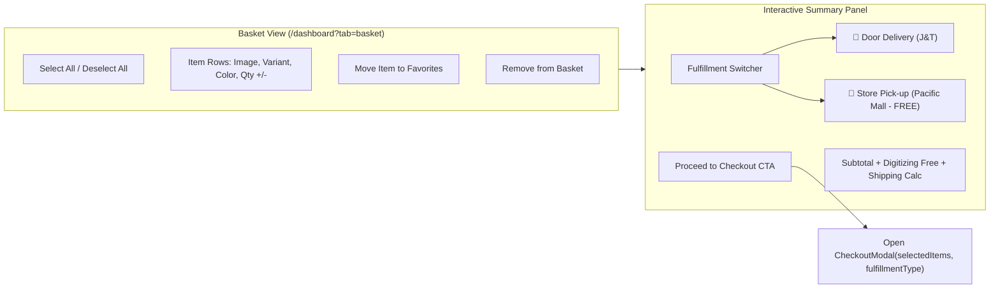
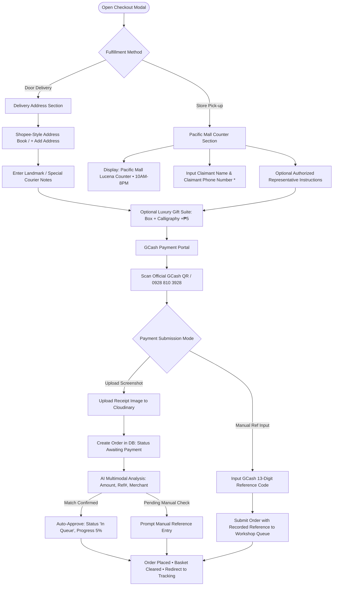
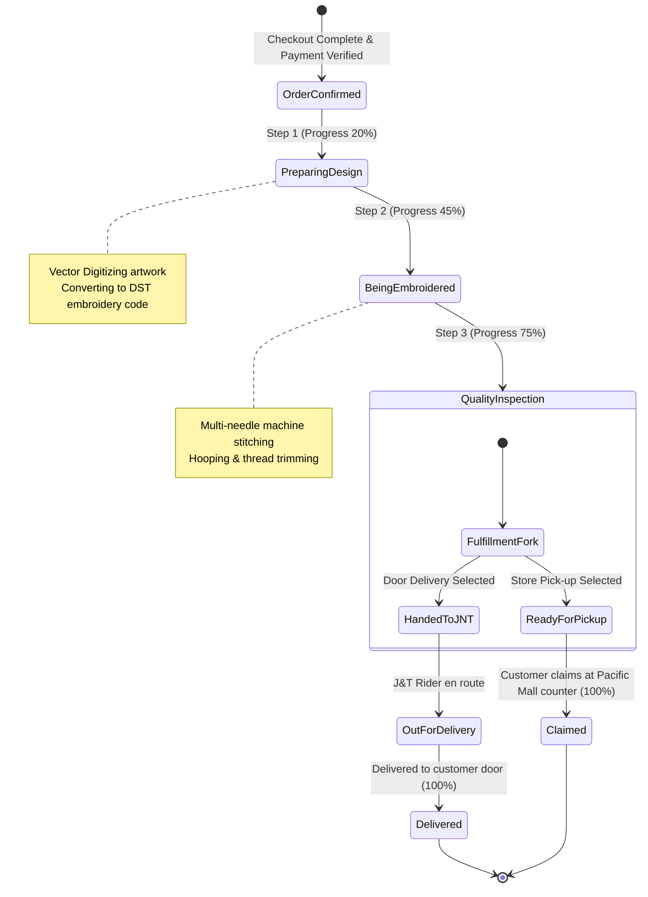
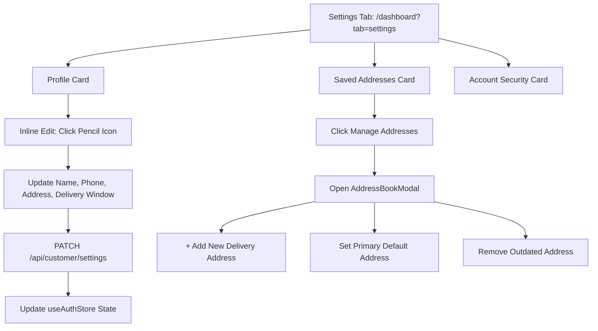
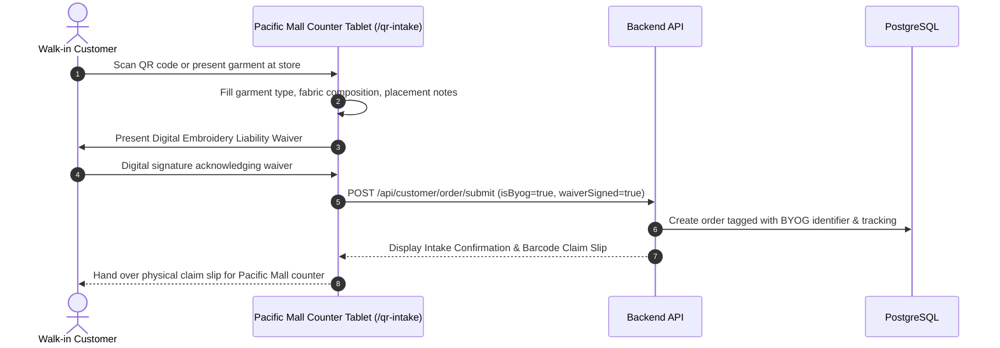

# Stitch-Opt: Comprehensive Customer Account & Journey Documentation
**Platform**: Stitch-Opt Automated Computerized Embroidery & E-Commerce Platform  
**Operating Entity**: Eds Towels & Caps Embroidery Studio (Pacific Mall Lucena, Quezon 4301)  
**System Architecture**: Next.js 16 (Turbopack) Frontend • Node.js / Express Backend • PostgreSQL + Prisma ORM • Socket.io • Gemini AI  

---

## 1. Executive Platform Architecture & Customer Sitemap

Stitch-Opt bridges online bespoke embroidery ordering with a physical workshop and retail presence at **Pacific Mall Lucena**. Unlike conventional off-the-shelf retail platforms, computerized embroidery requires vector digitizing, hooping, thread-color spooling, and automated multi-needle machine production before an order can be dispatched or claimed.

### Customer Portal Sitemap & Navigation Matrix

```
[Storefront Landing Page: /]
   ├── Product Catalog & Filter Bar
   ├── Interactive 3D / 2D Product Modal
   ├── AI Virtual Attendant Chatbot
   └── Auth Modal (Login / Register / Google OAuth)
         │
         ▼
[Customer Dashboard: /dashboard]
   ├── 🛍️ Shop Tab (?tab=shop)
   │     ├── Live Milestone Hero (Active Order Quick-Tracker)
   │     ├── Category Dropdown & Keyword Search
   │     └── Product Grid (Add to Bag / Buy Now / Favorite)
   │
   ├── 🧺 My Basket Tab (?tab=basket) [Full-Page Responsive Tab]
   │     ├── Selective Checkbox Item Selector (Select All / Individual)
   │     ├── Stock-Aware Quantity Modifiers
   │     ├── Fulfillment Selector: [Door Delivery (J&T)] vs [Store Pick-up (Pacific Mall)]
   │     ├── Real-time Cost Breakdown (Digitizing Included, Shipping Rules)
   │     └── Mobile Floating Checkout Bar
   │
   ├── 🧵 My Orders Tab (?tab=orders)
   │     ├── Sub-tabs: Active Projects vs Completed / Past Orders
   │     ├── 5-Stage Customer Stepper (Tone-adaptive badges)
   │     └── Order Details Modal:
   │           ├── Summary Tab: Line items, variants, digital BIR Tax Invoice
   │           └── Tracking Tab:
   │                 ├── Delivery: J&T Tracking Code, Sort Milestones, Printable Thermal Waybill
   │                 └── Pick-up: Store Claim Ref, Studio Milestones, Printable Claim Slip
   │
   ├── 💖 Favorites Tab (?tab=favorites)
   │     ├── Wishlisted Embroidery Designs
   │     └── 1-Click "Move All to Basket" Action
   │
   ├── 💳 Transactions Tab (?tab=transactions)
   │     ├── Filterable Financial Ledger (GCash Reference & Amount)
   │     └── Receipt & Tax Invoice Viewers
   │
   ├── ⚙️ Account Settings Tab (?tab=settings)
   │     ├── Inline Profile Field Editors (Name, Email, Phone, Address, Delivery Window)
   │     ├── Shopee-Style Address Book Manager (Home / Office / Default tags)
   │     └── Email Verification Status & Security Cards
   │
   └── 📱 Floating AI Attendant (24/7 Consultation & Status Lookup)
```

---

## 2. Journey 1: Onboarding, Authentication & Session Hydration



### Step-by-Step Experience
1. **Entry Point**: The customer lands on `/` or clicks `Sign In` / `Register` in the top storefront header.
2. **Registration**:
   - Customer supplies their desired username, valid email, and secure password.
   - Contact phone number and initial street address are optionally gathered upfront to expedite future checkout.
   - Database creates their account with role `customer`, initializing an empty saved address list and notification preference flags.
3. **Google Sign-In**:
   - Customers can bypass password entry via Firebase Google Authentication.
   - The backend validates the Google token cryptographically, auto-verifies email status, and maps their Google profile photo.
4. **Session Hydration & Security Guard**:
   - Upon page refresh, `useAuthStore` rehydrates user state from localStorage and cookies.
   - Route guards automatically prevent customer access to `/admin` or `/employee` and redirect unauthenticated users cleanly to `/?auth=login`.

---

## 3. Journey 2: Product Discovery, Customization & Wishlisting



### Key Functional Features
- **Stock-Aware Protection**: Real-time calculation checks available inventory:
  $$\text{Available Stock} = \max(0, \text{Total Product Count} - \text{Reserved Count})$$
  Customers cannot order quantities exceeding verified workshop warehouse blanks.
- **Color & Size Customization**: Customers preview available thread swatches and garment dimensions directly inside [ProductModal.tsx](file:///c:/Users/revin/Downloads/Capstone/frontend/src/components/products/ProductModal.tsx).
- **Wishlist Engine**: Clicking the heart icon toggles favorites stored in PostgreSQL and synced via [useProductStore.ts](file:///c:/Users/revin/Downloads/Capstone/frontend/src/stores/useProductStore.ts). The customer can move their entire wishlist into the basket with one click.

---

## 4. Journey 3: Native Basket Management & Selective Checkout

The basket in Stitch-Opt is implemented as a **native, responsive dashboard tab** (`/dashboard?tab=basket`), avoiding cramped popup sidebars and providing an intuitive shopping experience.



### Step-by-Step Experience
1. **Navigating to Basket**:
   - Accessible via the persistent sidebar navigation (`My Basket` with live notification badge count), the storefront header bag icon, or after adding a product.
2. **Selective Item Checkboxing**:
   - Customers can check/uncheck individual garments to purchase only what they want now, leaving other items saved in the basket for later.
   - Master checkbox allows 1-click **Select All**.
3. **Quantity Safeguards**:
   - Plus/minus controls validate against real-time warehouse stock. If a customer attempts to select more than available stock, an instant warning toast appears without reloading the page.
4. **Fulfillment Selection in Basket**:
   - **Door Delivery**: Shows standard J&T Express logistics partner preview and destination address.
   - **Store Pick-up**: Instantly updates shipping fee to **FREE (Store Pick-up)** and displays the pickup counter preview: `Eds Towels & Caps, Pacific Mall Lucena, Quezon (10AM – 8PM)`.
5. **Mobile View Floating Action Bar**:
   - On smartphone screens (<1024px), a sticky bottom checkout bar appears displaying the active item count, fulfillment badge (`🏪 Pick-up` or `🚚 Delivery`), running total, and checkout CTA.

---

## 5. Journey 4: Secure Checkout & Payment Processing (GCash Exclusive)

The checkout process in [CheckoutModal.tsx](file:///c:/Users/revin/Downloads/Capstone/frontend/src/components/checkout/CheckoutModal.tsx) handles fulfillment specifics and payment verification with zero ambiguity.



### Detailed Fulfillment Comparison

| Feature / Requirement | 🚚 Door-to-Door Delivery | 🏪 Store Counter Pick-up |
| :--- | :--- | :--- |
| **Logistics Provider** | J&T Express Philippines | In-Store Counter Team (Pacific Mall Lucena) |
| **Shipping Cost** | Standard 3PL delivery fee | **FREE (₱0.00)** |
| **Address Required** | Complete street, barangay, city, postal code | **No street address needed** |
| **Location Target** | Customer saved address (Home/Office) | Ground Floor, Pacific Mall Lucena, Quezon |
| **Contact Validation** | Recipient contact phone number | **Claimant phone number** (for SMS ready-alert) |
| **Operating Hours** | Courier dispatch schedule | **Mall Hours: 10:00 AM – 8:00 PM Daily** |
| **Tracking Number Format** | `JNT-PH-78XXXXXXXX` | `PU-LUC-XXXXXXXX` |
| **Printable Document** | Official 4x6" Thermal Waybill Sticker | Official Store Claim Slip & Receipt |

### Payment Processing Specifications
- **Exclusive GCash Mode**: Payment is accepted exclusively via GCash (`0928 810 3928` / *Eds Towels and Caps Embroidery*).
- **Dual Submission Reliability**:
  1. **Automated AI Verification**: Uploading a screenshot analyzes the image with Gemini AI. If the extracted amount matches the order total and the transaction date is current, the order is automatically confirmed into production.
  2. **Direct Manual Reference**: Customers can enter their 13-digit GCash reference number directly to place the order without waiting for OCR processing.

---

## 6. Journey 5: End-to-End Order Monitoring & Status Tracking



### Customer Order Monitoring Interface
1. **My Orders Tab (`/dashboard?tab=orders`)**:
   - Filter between **Active Orders** (currently in production/transit) and **Past Orders** (fulfilled/claimed).
   - Each order card displays thumbnail images, order ID, submission date, total price, and dynamic tone badges (`amber` for pending, `blue` for progress, `purple` for shipping/ready, `green` for completed).
2. **Order Details Modal (`OrderDetailsModal.tsx`)**:
   - **Summary Tab**: Full breakdown of items, sizes, custom thread colors, payment reference, and a button to view/print the official **BIR Tax Invoice**.
   - **Tracking Tab (`DeliveryTracker.tsx`)**:
     - *For Delivery*: Real-time J&T Express tracking code with 1-click copy, sorting hub timeline, and **🏷️ J&T Waybill Sticker** modal.
     - *For Pick-up*: Store pick-up badge, claim code (`PU-LUC-...`), Pacific Mall store hours, counter claiming timeline, and **📄 Claim Slip** modal.
3. **1-Click "Buy Again / Reorder"**:
   - Allows repeat customers (schools, corporate teams, clubs) to instantly reload identical custom products, thread colors, and quantities into their basket in seconds.

---

## 7. Journey 6: Account Profile & Address Book Settings



### Key Capabilities
- **Shopee-Style Address Book (`AddressBookModal.tsx`)**:
  - Customers can save multiple destinations (e.g. `🏠 Home`, `🏢 Office`, `🏫 Studio`).
  - Set a default delivery address that automatically pre-populates in checkout.
  - Full address validation: Recipient Name, Courier Phone Number, Detailed Street, Barangay, City, Province, and Postal Code.
- **Inline Settings Updates**:
  - Allows customers to update their contact phone number, default address, or preferred delivery window with automatic profile synchronization.

---

## 8. Journey 7: Walk-in / Bring Your Own Garment (BYOG) Intake

Stitch-Opt accommodates walk-in customers who bring their own garments (jackets, uniforms, heirloom towels) for custom embroidery via a digital intake flow:



---

## 9. Journey 8: 24/7 AI Virtual Attendant Consultation

On both the storefront and customer dashboard, the **AI Store Attendant** ([AiAttendant.tsx](file:///c:/Users/revin/Downloads/Capstone/frontend/src/components/chat/AiAttendant.tsx)) provides instantaneous assistance:

- **Bespoke Embroidery Guidance**: Explains the difference between direct garment embroidery, custom embroidered patches, and 3D puff embroidery.
- **Pricing & Digitizing Rules**: Clarifies digitizing fee policies, minimum orders, and bulk volume rates.
- **Store Logistics Inquiries**: Informs customers about Pacific Mall Lucena studio hours (10:00 AM – 8:00 PM Daily) and pickup counter instructions.
- **Order Status Lookups**: Allows customers to inquire about their active orders by providing their order ID or GCash reference.

---

## 10. Summary of Critical Business Rules & Safety Guards

1. **Payment Truth**: All orders require confirmed payment via GCash (`0928 810 3928`). PayMaya is obsolete and completely deprecated.
2. **Manufacturing Credibility**: The system never simulates fake motorbike delivery animations while an item is still being stitched. Workshop digitizing, machine hooping, and inspection are transparently reflected in the 5-stage progress indicator.
3. **Fulfillment Distinction**:
   - **Store Pick-up**: No street address required. Requires a valid claimant phone number. Tracking is formatted as `PU-LUC-...`. Shipping fee is ₱0.00.
   - **Door Delivery**: Requires a complete street address and contact phone number. Handed over to J&T Express with tracking formatted as `JNT-PH-78...`.
4. **Mobile First Ergonomics**: All journeys are optimized for smartphone viewports (360px–430px) with responsive touch targets, floating checkout bars, and bottom navigation.
