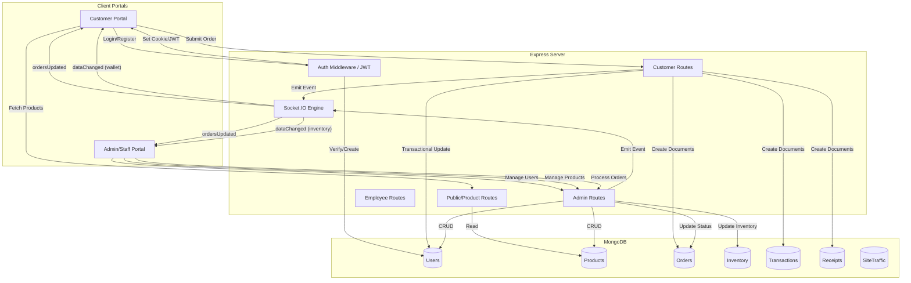

# System Data Flow Mapping

This document maps the end-to-end data flow of the Stitch Master AI system, detailing how information moves between the frontend, backend, and database.

## Architecture Overview

The system follows a classic **MERN-like** architecture (using Vanilla JS instead of React):
- **Frontend**: Vanilla HTML/CSS/JS served as static assets.
- **Backend**: Node.js with Express.
- **Database**: MongoDB (Atlas) for persistent storage.
- **Real-time**: Socket.IO for live dashboard synchronization.

---

## Data Flow Diagram

---

## Detailed Flows

### Summary of Accomplishments

### 1. Security & Rate Limiting
- **Hardened Endpoints**: Implemented strict rate limits for authentication and heavy dashboard state fetches in `server.js`.
- **Authorization Verification**: Ensured all modular controllers enforce role-based access control.

### 2. Architecture & Standardization
- **API Versioning**: All requests now support `/api/v1/` routing for future-proofing.
- **Unified Payloads**: Created `utils/apiConstants.js` to standardize `{ action, entity, payload }` schemas.
- **Joi Validation**: Integrated schema validation for all incoming REST and Socket.IO payloads via `utils/validation.js`.

### 3. Database Layer Optimization
- **Advanced Indexing**: Deployed compound and covering indexes for `Order` and `Transaction` models to minimize disk lookups.
- **Index Maintenance**: Created `extra_scripts/index_maintenance.js` for diagnostic monitoring of index performance.

### 4. Backend & Real-time Efficiency
- **Pagination & Lean Queries**: Enabled server-side pagination and `.lean()` queries for all dashboard views to reduce memory and payload sizes.
- **Delta-based Synchronization**: Standardized Socket.IO to emit only granular data changes (deltas) instead of full document re-fetches.
- **Observability**: Implemented `utils/logger.js` and `utils/socketUtil.js` to track socket payload sizes and event frequencies.

### 5. Frontend UX Enhancements
- **Perceived Performance**: Added glassmorphic skeleton loaders and pagination indicators for smooth data transitions.
- **Resiliency**: Implemented optimistic UI updates with automatic rollback logic for status changes and wallet operations.
- **Robust Sockets**: Configured Socket.IO with exponential backoff and reconnection strategies.

### 6. Scalability Prototype
- **Redis Adapter**: Integrated support for `@socket.io/redis-adapter` in `server.js` to enable horizontal scaling across multiple instances.
- **Monitoring Hooks**: Added hooks for logging rollback triggers and payload size alerts.

### 2. Transactional Order Processing
When a customer submits an order, the backend executes a **MongoDB Session Transaction** to ensure data integrity:
1. **Validation**: Checks inventory levels and (if using wallet) user balance.
2. **Deduction**: Atomically decrements the `User.walletBalance`.
3. **Creation**: Simultaneously creates three linked documents:
    - **Order**: Main order tracking.
    - **Transaction**: Financial record for the ledger.
    - **Receipt**: Immutable proof of purchase.
4. **Synchronization**: Once committed, Socket.IO broadcasts `ordersUpdated` to both the customer (to refresh their history) and the staff (to alert them of the new order).

### 3. Real-time State Synchronization
The system minimizes manual page refreshes using an event-driven model:
- **`ordersUpdated`**: Notifies all relevant parties that an order state has changed.
- **`dataChanged`**: A generic event used to signal that a specific collection (Products, Inventory, Wallet) needs a partial or full UI update.
- **Room-based Emits**: Wallet updates are sent only to the specific user's room (`user:<id>`), while order updates are sent to the user and the `staff` room.

### 4. Analytics & Traffic
- **SiteTraffic**: Every page visit (or specific path) is logged to the `SiteTraffic` collection via the `/api/analytics/visit` endpoint.
- **Aggregation**: The Admin dashboard performs complex aggregations (`$group`, `$unwind`, `$lookup`) to generate revenue trends, status distributions, and "Top Liked" product lists in real-time.

---

## Model Relationships

- **Order** links to **User** via `userId`.
- **Order** links to **Transaction** via `transactionId`.
- **Order** links to **Receipt** via `receiptRef`.
- **Transaction** and **Receipt** both reference the **Order** via `orderRef`.
- **User** tracks **Products** in a `favorites` array.
