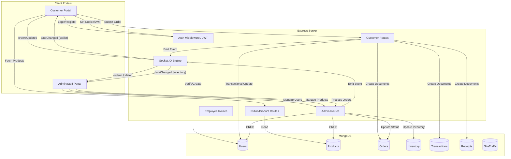

# System Data Flow Mapping

This document maps the end-to-end data flow of the Stitch Master AI system, detailing how information moves between the frontend, backend, and database.

## Architecture Overview

The system follows a classic **MERN-like** architecture (using Vanilla JS instead of React):
- **Frontend**: Vanilla HTML/CSS/JS served as static assets.
- **Backend**: Node.js with Express.
- **Database**: MongoDB (Atlas) for persistent storage.
- **Real-time**: Socket.IO for live dashboard synchronization.

---

## Data Flow Diagram

---

## Detailed Flows

### 1. Authentication & Security
- **JWT Persistence**: Tokens are stored in HttpOnly cookies (`token`, `admin_token`, etc.) to maintain session state.
- **CSRF Protection**: A double-submit cookie pattern is used. The client fetches a token from `/api/auth/csrf-token` and must include it in the `X-CSRF-Token` header for state-changing requests (POST/PUT/DELETE).
- **Socket Auth**: Socket.IO connections are authenticated by reading the JWT from the handshake cookies, allowing users to join private rooms (e.g., `user:<id>`) or role-based rooms (e.g., `staff`).

### 2. Transactional Order Processing
When a customer submits an order, the backend executes a **MongoDB Session Transaction** to ensure data integrity:
1. **Validation**: Checks inventory levels and (if using wallet) user balance.
2. **Deduction**: Atomically decrements the `User.walletBalance`.
3. **Creation**: Simultaneously creates three linked documents:
    - **Order**: Main order tracking.
    - **Transaction**: Financial record for the ledger.
    - **Receipt**: Immutable proof of purchase.
4. **Synchronization**: Once committed, Socket.IO broadcasts `ordersUpdated` to both the customer (to refresh their history) and the staff (to alert them of the new order).

### 3. Real-time State Synchronization
The system minimizes manual page refreshes using an event-driven model:
- **`ordersUpdated`**: Notifies all relevant parties that an order state has changed.
- **`dataChanged`**: A generic event used to signal that a specific collection (Products, Inventory, Wallet) needs a partial or full UI update.
- **Room-based Emits**: Wallet updates are sent only to the specific user's room (`user:<id>`), while order updates are sent to the user and the `staff` room.

### 4. Analytics & Traffic
- **SiteTraffic**: Every page visit (or specific path) is logged to the `SiteTraffic` collection via the `/api/analytics/visit` endpoint.
- **Aggregation**: The Admin dashboard performs complex aggregations (`$group`, `$unwind`, `$lookup`) to generate revenue trends, status distributions, and "Top Liked" product lists in real-time.

---

## Model Relationships

- **Order** links to **User** via `userId`.
- **Order** links to **Transaction** via `transactionId`.
- **Order** links to **Receipt** via `receiptRef`.
- **Transaction** and **Receipt** both reference the **Order** via `orderRef`.
- **User** tracks **Products** in a `favorites` array.
